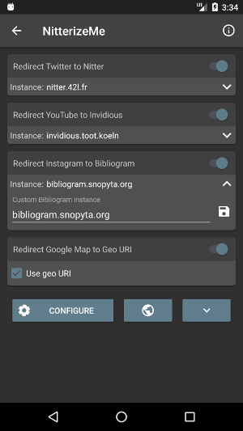
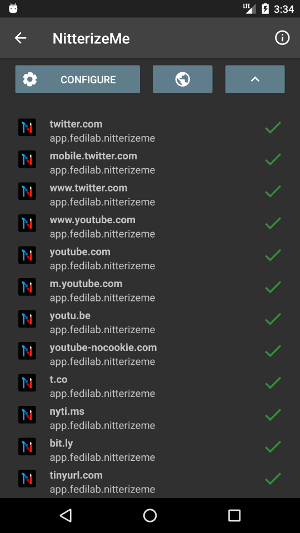
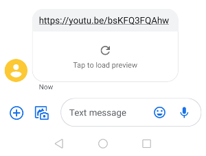

## NitterizeMe

NitterizeMe once set by default to open Twitter and YouTube links will transform them into Nitter and Invidious links and delegate the action to another app.

### What is Nitter:

A free and open source alternative Twitter front-end focused on privacy.
Github project: [/zedeus/nitter](https://github.com/zedeus/nitter)

### What is Invidious:

A free and open source alternative front-end to YouTube
Github project: [/omarroth/invidious](https://github.com/omarroth/invidious)

### Screenshots:

 

 

