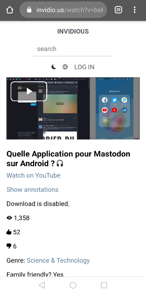

# UntrackMe    

UntrackMe once set by default to open Twitter and YouTube links will transform them into Nitter and Invidious links and delegate the action to another app.

There are two version of UntrackMe - Once handling all URLs for removing tracking parameters - Another one called "UntrackMe Lite" that will only handle Twitter, Youtube, Instagram, Google Maps and shortened URLs.

## Donate

## Download

Full version: 

Lite version: 

### What is Nitter:

A free and open source alternative Twitter front-end focused on privacy.
Github project: [/zedeus/nitter](https://github.com/zedeus/nitter)

### What is Invidious:

A free and open source alternative front-end to YouTube
Github project: [/omarroth/invidious](https://github.com/omarroth/invidious)

### What is Bibliogram:

A free and open source alternative front-end to Instagram
Github project: [/cloudrac3r/bibliogram](https://github.com/cloudrac3r/bibliogram)

### Screenshots:

   

   

### Going further

For a full coverage with URLs, you can use FireFox with the [Invidition](https://addons.mozilla.org/fr/firefox/addon/invidition/) plugin from [@booteille](https://framapiaf.org/@booteille).

Source code of [Invidition on Godeberg](https://codeberg.org/Booteille/invidition)